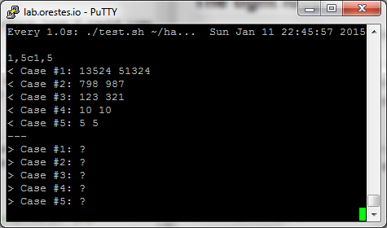
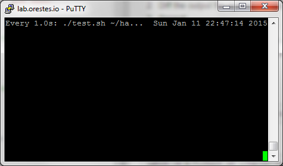

Facebook Hacker Cup
---

## Organization ##

The directory follows a **year**/**round**/**problem** structure.

Every problem

- Is in a directory named using the point value and the problem name, like **30 Balanced smileys**.
- Contains a readme file with the full description of the problem.
- Contains an `example` directory with the input and output files provided in the problem description.
- The `data` directory contains the generated input provided for the submission.
- The `generated` directory contains the output generated for the submission.

## The tight loop ##

I'm using the simplest quickest feedback loop I could come up with:

1. Run the program piping in the input from the example file, and piping out the output to an output file.
1. Diff the generated output file against the expected output file.
1. Repeat

`test.sh` does the first two steps. The `watch` utility does the repeating part.

An example using php: 

    watch -n 1 "./test.sh ~/hacker-cup/00/15 'php solve.php'"

Using python:

    watch -n 1 "./test.sh ~/hacker-cup/00/15 'python solve.py'"

### Solving ###

### Solved ###

## License

MIT © [Orestes Carracedo](http://orestescarracedo.com)
